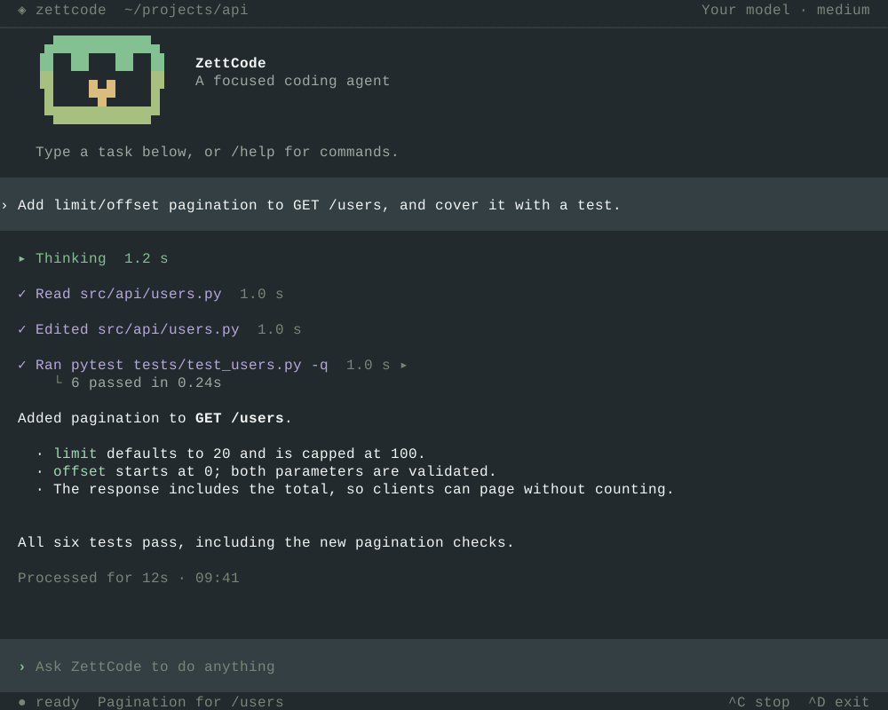

<p align="center">
  
</p>
<h1 align="center">ZettCode</h1>
<p align="center"><strong>你的终端。你的编码伙伴。</strong></p>
<p align="center">专注的编码智能体：读懂项目、展示过程，把决定权留给你。</p>
<p align="center">
  <a href="README.md">English</a> · <strong>简体中文</strong><br />
  <a href="https://chang-lehung.github.io/zettcode/zh/guide/getting-started">快速开始</a> ·
  <a href="https://chang-lehung.github.io/zettcode/zh/">使用文档</a> ·
  <a href="https://chang-lehung.github.io/zettcode/zh/guide/commands">命令参考</a>
</p>

<p align="center">
  
</p>
<p align="center"><sub>示例对话由 ZettCode 的实际终端组件渲染。</sub></p>

## 先跑起来

需要 **Python 3.10+**、支持 UTF-8 的终端和 **OpenAI 兼容接口**。
支持 macOS、Linux 和 Windows（请使用 Windows Terminal）。

### 1. 安装

```bash
uv tool install zettcode
# 或者：pip install zettcode
```

### 2. 连接模型

创建 `~/.zettcode/config.toml`（以及父目录），先配置一个模型：

```toml
[[models]]
model = "deepseek-v4-pro"             # 发给 DeepSeek 的模型 id
display_model = "DeepSeek Pro"        # ZettCode 界面中显示的名字
token = "sk-..."                      # 替换成你的 DeepSeek API key
base_url = "https://api.deepseek.com"  # DeepSeek 的 OpenAI 兼容接口根地址
context_window = 1000000               # 以接入点当前公布的实际限制为准
multimodal = false                    # 这个模型接受文本，不接受图片
```

在 [DeepSeek 开放平台](https://platform.deepseek.com/)创建 API key，不是聊天网页的登录信息。
也可以省略 `token`，改用 `OPENAI_API_KEY` 环境变量保存这个 key。
添加更多 `[[models]]`，就能用 `/model` 切换；启动时默认选择第一项。
完整示例、默认值和排错步骤见[配置参考](https://chang-lehung.github.io/zettcode/zh/guide/config)。

### 3. 发出任务

```bash
cd /path/to/project
zettcode
# 或者：zettcode --workspace /path/to/project
```

描述要改什么，按 **Enter**。`/` 打开命令菜单，`@` 引用 skill，**Ctrl-C** 停止请求。
输入框为空时按 **Ctrl-D** 退出，终端会打印恢复当前会话的命令。

## 按你的方式工作

| | |
| --- | --- |
| **看清每一步** | 思考、回答和工具调用实时呈现为可读的行，不是原始 JSON。 |
| **决定权在你手上** | 执行 shell 命令前先审阅；智能体需要你的决定时，可以选选项，也可以打字回答。 |
| **工作不中断** | 回复过程中发送 steering（引导）消息；用 `/btw` 问一句，不让它进入后续上下文。 |
| **随时接着做** | `/resume` 恢复对话，`/export` 导出便于阅读的 HTML。 |
| **看懂上下文** | 查看 token 与缓存统计，用 `/context` 检查占用，在需要时压缩。 |
| **接入你的工具** | 使用项目 `AGENTS.md` 指令、skills、MCP 服务器和 Python 插件。 |

主题跟随终端背景，也可以使用你自己的 `theme.toml`。
选中复制文字、滚动查看回答；模型支持多模态时，还能粘贴图片。

## 找到你的下一步

**[用户指南](https://chang-lehung.github.io/zettcode/zh/guide/overview)** 提供简体中文与
[English](https://chang-lehung.github.io/zettcode/guide/overview) 两个版本。

| 第一次使用 | 日常使用 | 配置与扩展 |
| --- | --- | --- |
| [快速开始](https://chang-lehung.github.io/zettcode/zh/guide/getting-started) | [快捷键与鼠标](https://chang-lehung.github.io/zettcode/zh/guide/keys) | [配置参考](https://chang-lehung.github.io/zettcode/zh/guide/config) |
| [认识界面](https://chang-lehung.github.io/zettcode/zh/guide/interface) | [命令参考](https://chang-lehung.github.io/zettcode/zh/guide/commands) | [模型与上下文](https://chang-lehung.github.io/zettcode/zh/guide/models) |
| [常见问题](https://chang-lehung.github.io/zettcode/zh/guide/faq) | [会话管理](https://chang-lehung.github.io/zettcode/zh/guide/sessions) | [项目指令](https://chang-lehung.github.io/zettcode/zh/guide/instructions) |
| | | [Skills 与 MCP](https://chang-lehung.github.io/zettcode/zh/guide/skills-and-mcp) · [插件](https://chang-lehung.github.io/zettcode/zh/guide/plugins) |

## 开发

```bash
uv sync                         # 安装依赖
make check                      # Ruff、mypy 与测试
make hooks                      # 每次提交前强制检查 mypy
make demo                       # 浏览终端组件
make docs                       # 本地预览使用文档
uv run zettcode --workspace .    # 从源码运行
```

ZettCode 提供终端应用，智能体运行时来自
[`zett-agent`](https://github.com/Chang-LeHung/zett-agent)。贡献者约定和不变量放在
[`AGENTS.md`](AGENTS.md) 与 [`docs/internal/`](docs/internal/)，不进入用户指南。
本地预览、重新生成效果图的方法见
[`docs/internal/site-design.md`](docs/internal/site-design.md)。

## 许可证

MIT，见 [`LICENSE`](LICENSE)。
